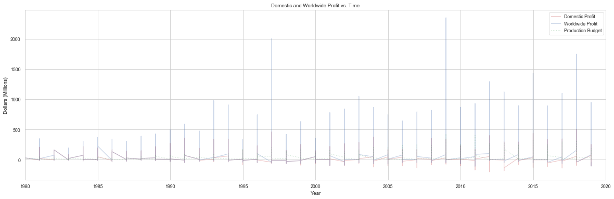
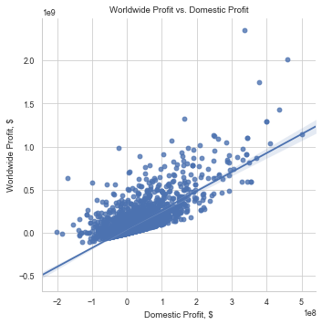
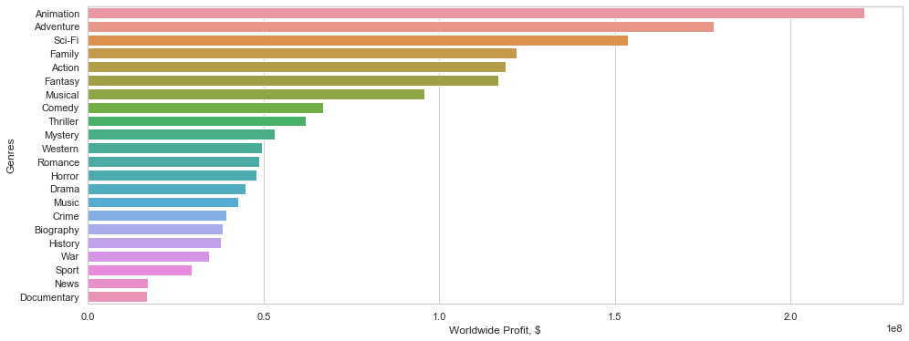
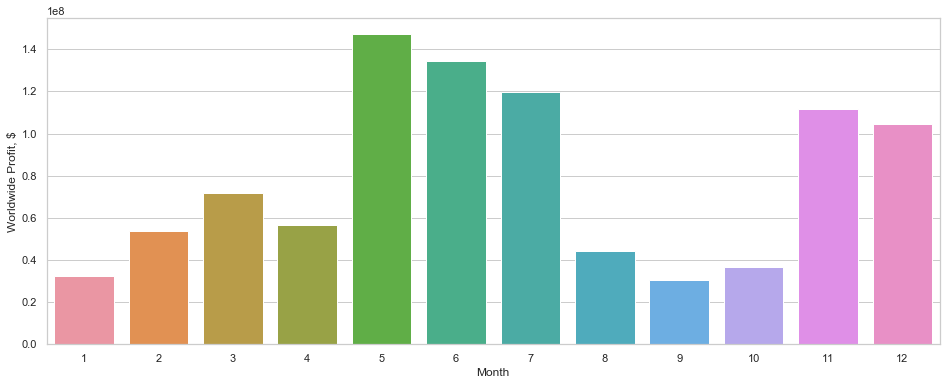
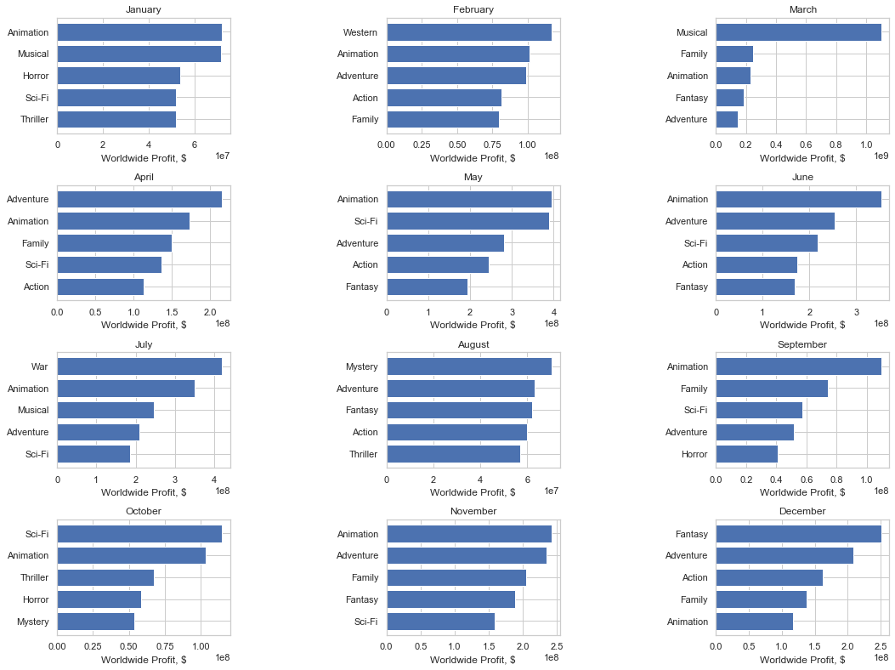

# Module 1 Final Project

## Outline
-----------------------------------------
    ├── LICENSE
    ├── README.md                  <- The project layout (this file)
    ├── zippedData                 <- This is where the project data is located
    │
    ├── student.ipynb              <- This is the main notebook (contains the python code)
    │
    ├── reports                    <- Reports and presentations
    │   └── presentation.pdf       <- Non-technical presentation
    │
    ├── images                     <- Where the graphs are saved
    ├── requirements.txt           <- The requirements file for reproducing the analysis environment

## Conclusion

### Where is the bulk of the profit coming from (international vs domestic)?

According to the above Domestic and Worldwide Profit vs. Time plot, over the past 40 years, profit due to the international market has been growing at a faster rate than the domestic market without a proportional increase in overall production budget. This is further shown in the Worldwide Profit vs. Domestic Profit scatter plot which shows a positive relationship between domestic profit and worldwide profit with a slope greater than 1. This growth of the international market relative to the domestic market could be explained by saturation of US and Canadian markets (an adequate supply of tickets for the available demand), an increase in global marketing (perhaps promotion via social media), and/or the reduction of restrictions on which movies can be seen in a particular region or country, such as China. This should be capitalized on with an increase in marketing targetting the global markets. 

### Which genres generate the highest worldwide profit?

According to the above bar plot, Worldwide Profit vs Genres, the five genres with the highest worldwide profit, in order, are: Animation, Adventure, Sci-Fi, Family, and Action.

### Which months generate the highest worldwide profit?

According to the above bar plot, Month vs Worldwide Profit, the five months that generate the highest worldwide profit, in order, are: May, June, July, November, and December.

### What are the top 5 profit genres for each month?

According to the bar graphs above, the 5 genres that generate the highest worldwide profits for each month are, in order:

    January: Animation, Musical, Horror, Sci-Fi, and Thriller.

    February: Western, Animation, Adventure, Action, and Family.

    March: Musical, Family, Animation, Fantasty, and Adventure.

    April: Adventure, Animation, Family, Sci-Fi, and Action.

    May: Animation, Sci-Fi, Adventure, Action, and Fantasty.

    June: Animation, Adventure, Sci-Fi, Action, and Fantasty.

    July: War, Animation, Musical, Adventure, and Sci-Fi.

    August: Mystery, Adventure, Fantasty, Action, and Thriller.

    September: Animation, Family, Sci-Fi, Adventure, and Horror.

    October: Sci-Fi, Animation, Thriller, Horror, and Mystery.

    November: Animation, Adventure, Family, Fantasty, and Sci-Fi.

    December: Fantasy, Adventure, Action, Family, and Animation.

## Recommendations

Based on the above information, it is recommended that a movie is released in May, June, July, November, or December. 

Special emphasis should be given to the international market due to its rapid growth compared with the domestic market. This can be done with a greater allocation of overall marketing budget towards that market, with the utilization of social media, along with focusing on stories, characters, and ideas that are of interest to other countries and regions. 

If the movie is released in May, focus on these three genres: Animation, Sci-Fi, and/or Adventure. 
If the release month is June, focus on: Animation, Adventure, and/or Sci-Fi. 
If the release month is July, focus on: War, Animation, and/or Musical. 
If the release month is November, focus on: Animation, Adventure, and/or Family. 
And if the release month is in December, focus on: Fantasy, Adventure, and/or Action.

If the release month cannot be pre-determined, then focus on the following genres: 
Animation, Adventure, Sci-Fi, Family, and/or Action.
